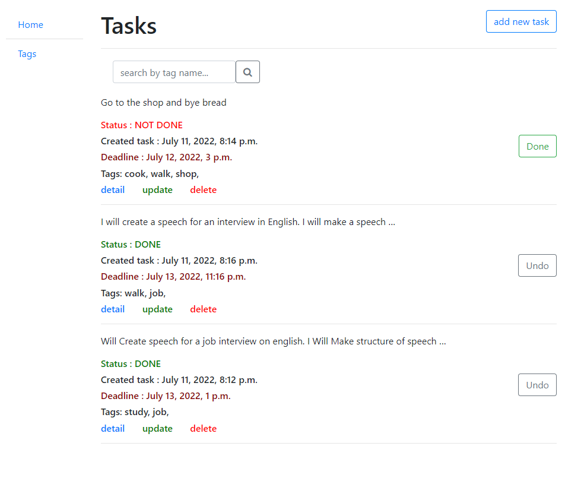
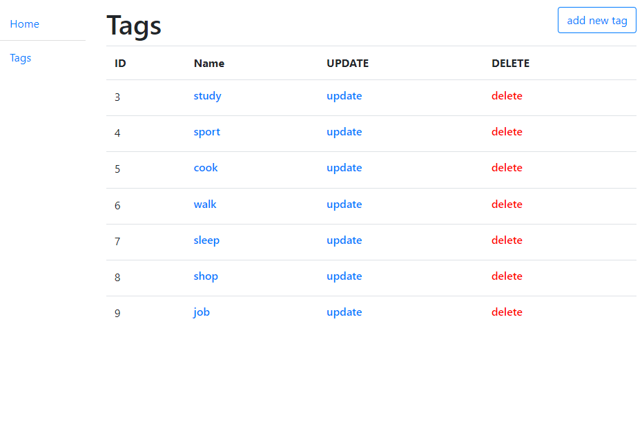

# Doit

Django project - to do list. 


## Installing / Getting started

Python 3 must be already installed

```shell
git clone https://github.com/KatiukhaO/taxi
cd todo
python -m venv venv
venv/scripts/activate
pip install -r requirements.txt
python manage.py runserver  # start Django project
```

## Features

* Create tasks and make deadline for tasks.
* Create tags and added tags for task
* Search by tags
* Create, update delete for tasks
* Switch status fof task. Done or not done. 
* Not done tasks show on the top list tasks.

## Demo


